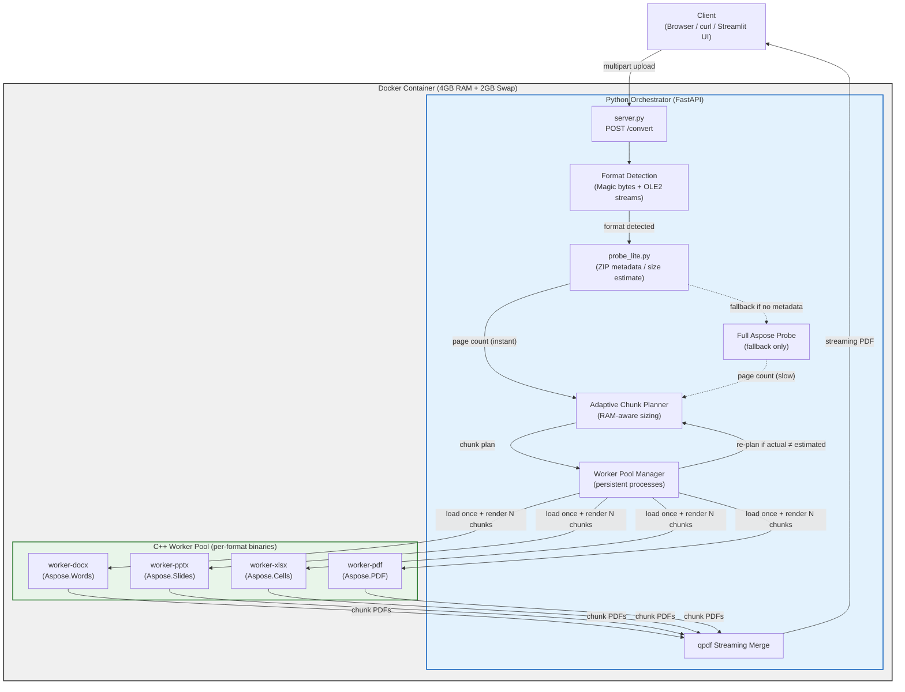
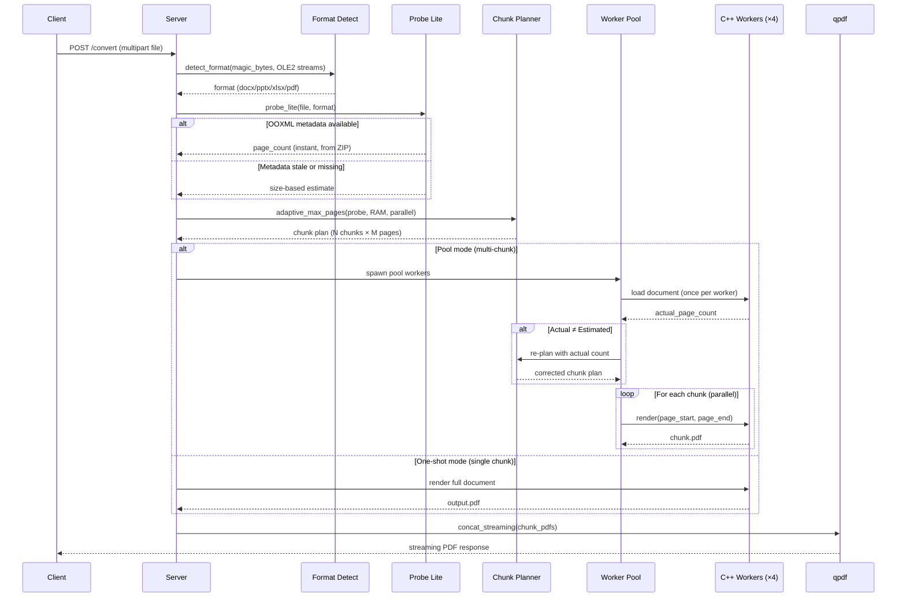
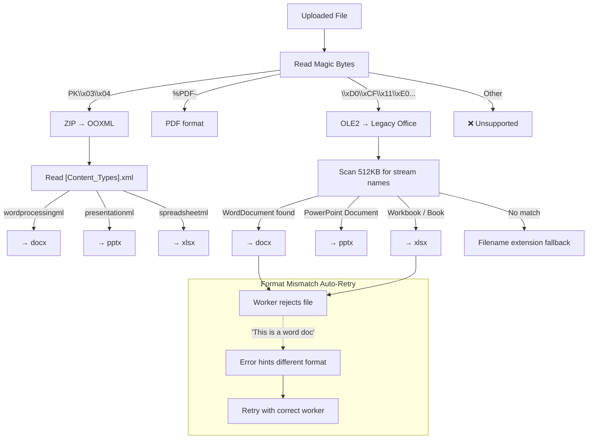
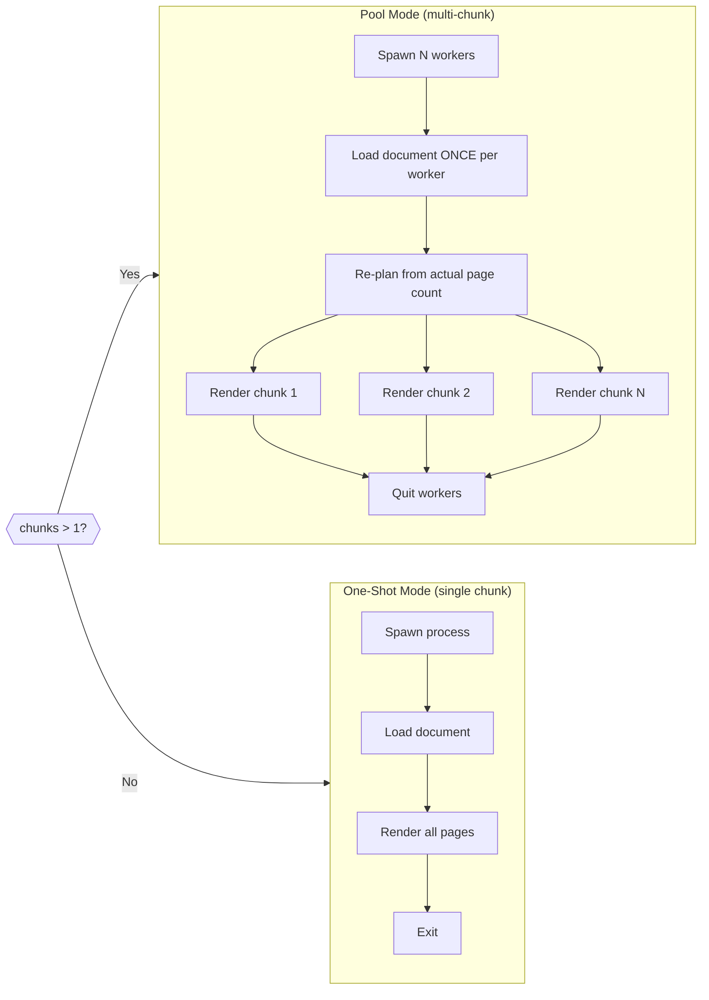

# Office Convert — Architecture Diagram

## System Overview

## Request Flow (Detailed)

## Format Detection Flow

## Pool Mode vs One-Shot Mode

## Performance Characteristics

| Metric | Before (v1) | After (optimized) | Improvement |
|--------|-------------|-------------------|-------------|
| Probe time | 15+ min (Aspose) | <0.01s (metadata) | ∞ |
| PPTX 8.5 MB (28 slides) | ~337s | 11.6s | 29× |
| DOCX 42 KB (1 page) | N/A | 0.6s | Baseline |
| XLSX 10 MB (2501 pages) | Timeout | ~10 min | Now completes |
| Repeated conversion | Same | <1s (with cache) | ∞ |

## Key Design Decisions

1. **Pool mode**: Document loaded once, rendered N times → eliminates redundant load overhead
2. **Adaptive chunk sizing**: RAM-aware, parallelism-aware → optimal chunk count per file
3. **Auto re-planning**: Pool reports actual page count → corrects stale estimates automatically
4. **Format retry**: Worker hints at correct format → handles mislabeled files gracefully
5. **Size-based probe fallback**: Instant estimate → avoids 15+ min Aspose probe
6. **Streaming response**: qpdf pipes directly to HTTP → no output buffering
