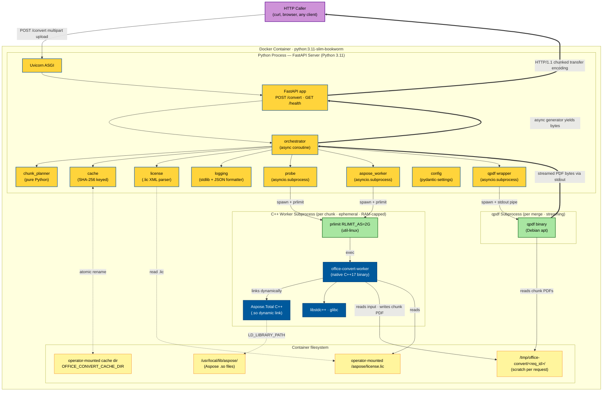

# Application Design — Office Converter (Local v1)

## Purpose

Consolidated view of the v1 application design. Aggregates the four
mandatory design artifacts:

- [`components.md`](./components.md) — component definitions and
  responsibilities
- [`component-methods.md`](./component-methods.md) — method signatures
- [`services.md`](./services.md) — service-level pipeline and
  concurrency
- [`component-dependency.md`](./component-dependency.md) — dependency
  matrix, communication patterns, data flow

## One-Paragraph Summary

A single FastAPI process (`office_convert.server:app`) exposes `POST
/convert` and `GET /health` on localhost. Per request, the
**orchestrator** buffers the multipart input to a per-request scratch
directory, probes the document via a worker subprocess, plans
deterministic chunks bounded by 10 pages or 50 MB, and dispatches
chunk renders to **`/usr/local/bin/office-convert-worker`** (a native
C++ binary linking Aspose.Total C++) subprocesses with `prlimit
--as=2147483648` enforcing the 2 GB ceiling. Each worker applies
the Aspose temporary license via `Aspose::License::SetLicense()`,
renders its page range to a chunk PDF using `LoadOptions::TempFolder`
+ memory-optimization knobs, and exits. Concurrency is bounded at two levels:
`asyncio.Semaphore(max_jobs)` at the server, `asyncio.Semaphore(parallel)`
inside each job (defaults 1 × 2 = 4 GB peak Aspose RAM). OOMs trigger
subdivision-on-retry through the pure `chunk_planner.subdivide(...)`
function down to a single-page floor; floor failures surface as 500
with a structured diagnostic. The orchestrator streams chunk PDFs
through a `qpdf --empty --pages ... -- -` subprocess via chunked
transfer encoding, so the merged PDF is never materialized in memory
or on disk on the server side. A separate `cache` module
(content-addressable, keyed by `<aspose_version>/<sha256>`) handles
final-output and per-chunk reuse when `OFFICE_CONVERT_CACHE_DIR` is
set. All `OFFICE_CONVERT_*` env vars are loaded into a single
pydantic-settings `Settings` model. JSON-lines structured logging
propagates `request_id` across async tasks via `contextvars`.

## Architectural Principles

1. **Pure cores, impure shells.** `chunk_planner` is pure. `cache` is
   nearly pure (filesystem reads/writes with stable keys). Everything
   that touches Aspose is in subprocesses we can RAM-isolate.
2. **Subprocess isolation for memory ceilings.** The 2 GB ceiling is
   enforced by the OS kernel via `RLIMIT_AS`, not by application
   convention. Every chunk render and every probe runs in a fresh
   worker subprocess.
3. **Streaming everywhere on the output path.** The merged PDF is
   never buffered. qpdf streams to its stdout; we pipe that stdout to
   the HTTP response body. The HTTP framework streams via chunked
   transfer encoding.
4. **No shared mutable state.** Across requests: cache (content-
   addressable, no coordination needed) and license (immutable until
   operator replaces file). No database. No in-memory job table.
5. **Failure paths are first-class.** Each failure mode maps to a
   specific HTTP status + structured diagnostic with `request_id`,
   matching the requirements doc (FR-5).
6. **Determinism where it matters.** Chunk planning, subdivision, and
   cache keys are deterministic for a given input. Aspose's render
   itself is not byte-for-byte deterministic (accepted in NFR-5),
   but the surrounding machinery is.

## Component Roster (one-liners)

| Module          | One-line purpose                                                                          |
| --------------- | ----------------------------------------------------------------------------------------- |
| `server`        | FastAPI routes, request lifecycle, response streaming                                     |
| `config`        | pydantic-settings model for `OFFICE_CONVERT_*` env vars                                   |
| `orchestrator`  | Per-request async generator coordinating the full pipeline                                |
| `chunk_planner` | Pure functions: `plan_chunks`, `subdivide`, `chunk_sha256`                                |
| `aspose_worker` | Orchestrator-side wrapper that spawns the C++ worker binary with `prlimit`                |
| `worker` (C++)  | Compiled C++ binary `/usr/local/bin/office-convert-worker` linking Aspose.Total C++       |
| `qpdf`          | Streaming PDF concat via `qpdf` binary, async byte iterator                               |
| `cache`         | Filesystem cache for final + per-chunk PDFs, keyed by `<aspose_version>/<sha256>`         |
| `license`       | Load `.lic`, expose `days_remaining()` / `is_expired()`, apply to Aspose runtime          |
| `probe`         | Aspose-based input introspection via worker subprocess in `--probe` mode                  |
| `logging`       | JSON-lines + human formatters, `request_id` propagation via `contextvars`                 |
| `types`         | Shared frozen dataclasses (Chunk, ChunkPlan, ProbeResult, ConversionResult, Diagnostic)   |

## Technology Architecture

### Runtime Topology

The diagram below shows every technology component active at request
time, labelled with its language/runtime and its role.



**Reading the diagram:**

- **Yellow (Python)** — the FastAPI server process. Everything inside
  it runs in a single Python 3.11 interpreter under Uvicorn.
- **Blue (C++)** — the worker subprocess. Spawned per chunk, RAM-
  capped to 2 GB, exits when done. Contains zero Python.
- **Green (native binaries)** — `prlimit` (RAM enforcement) and
  `qpdf` (streaming concat). Each used by Python via
  `asyncio.create_subprocess_exec`.
- **Yellow (filesystem)** — bind-mounted volumes (cache + license)
  and per-request scratch.
- **Thick arrows (`==>`)** — streaming byte paths. The merged PDF
  never lands on disk on the server side; it flows from qpdf stdout
  → orchestrator async generator → FastAPI StreamingResponse →
  HTTP chunked transfer encoding → client. Zero in-memory
  buffering of the output PDF.

### Build-Time Topology (Multi-Stage Dockerfile)

```mermaid
flowchart LR
    subgraph Stage1["Stage 1 — C++ Builder<br/>FROM debian:bookworm"]
        direction TB
        S1Apt["apt-get: gcc-12 cmake build-essential"]
        S1Tarball["COPY aspose-total-cpp.tar.gz<br/>from build context"]
        S1Extract["tar -xzf → /opt/aspose-sdk/<br/>(headers + .so)"]
        S1Cpp["COPY worker_cpp/<br/>(CMake project)"]
        S1Build["cmake --build<br/>→ office-convert-worker"]
        S1Apt --> S1Tarball --> S1Extract --> S1Cpp --> S1Build
    end

    subgraph Stage2["Stage 2 — Runtime<br/>FROM python:3.11-slim-bookworm"]
        direction TB
        S2Apt["apt-get: qpdf util-linux libstdc++6"]
        S2User["useradd appuser:appgroup"]
        S2Py["uv pip install --frozen<br/>(FastAPI, pydantic-settings, etc.)"]
        S2Copy1["COPY --from=builder<br/>office-convert-worker<br/>→ /usr/local/bin/"]
        S2Copy2["COPY --from=builder<br/>/opt/aspose-sdk/lib/*.so<br/>→ /usr/local/lib/aspose/"]
        S2Copy3["COPY office_convert/<br/>(Python package)"]
        S2Env["ENV LD_LIBRARY_PATH=/usr/local/lib/aspose<br/>OFFICE_CONVERT_* defaults"]
        S2User2["USER appuser"]
        S2Cmd["CMD ['uvicorn', 'office_convert.server:app', ...]"]
        S2Apt --> S2User --> S2Py --> S2Copy1 --> S2Copy2 --> S2Copy3 --> S2Env --> S2User2 --> S2Cmd
    end

    S1Build -- "binary" --> S2Copy1
    S1Extract -- "Aspose .so files" --> S2Copy2

    classDef builder fill:#FFCCBC,stroke:#BF360C,stroke-width:2px,color:#000
    classDef runtime fill:#C5CAE9,stroke:#283593,stroke-width:2px,color:#000

    class S1Apt,S1Tarball,S1Extract,S1Cpp,S1Build builder
    class S2Apt,S2User,S2Py,S2Copy1,S2Copy2,S2Copy3,S2Env,S2User2,S2Cmd runtime
```



**Reading the build diagram:**

- **Stage 1 (orange)** is throwaway: produces just two artifacts
  (the worker binary, the Aspose `.so` files) and is discarded
  after `COPY --from=builder` lines extract them. The C++
  compiler, CMake, build dependencies, and Aspose headers never
  appear in the final image.
- **Stage 2 (blue)** is the shipped image: Python runtime + thin
  apt deps + the worker binary + Aspose `.so` files + the Python
  package. Non-root user, `LD_LIBRARY_PATH` pointed at the Aspose
  library directory.
- **The Aspose tarball comes from the build context** (Q5 = B
  default) — operator places `aspose-total-cpp.tar.gz` next to
  the Dockerfile. No network calls during the build.

### Technology Summary

| Layer                         | Technology                                         |
| ----------------------------- | -------------------------------------------------- |
| HTTP / API                    | FastAPI on Uvicorn (Python 3.11)                   |
| Orchestration                 | asyncio (stdlib)                                   |
| Chunk planning, cache, types  | Pure Python                                        |
| Configuration                 | pydantic-settings v2                               |
| Logging                       | stdlib `logging` + custom JSON formatter           |
| Worker process                | Native C++17 binary (`office-convert-worker`)      |
| Document rendering            | Aspose.Total C++ (dynamic-linked `.so`)            |
| PDF concatenation             | qpdf binary (Debian package, streaming)            |
| Memory ceiling enforcement    | `prlimit` from util-linux (kernel RLIMIT_AS)       |
| Build system                  | CMake 3.25+ (C++); uv (Python)                     |
| Container                     | Multi-stage Dockerfile, runtime = python:3.11-slim-bookworm |
| Tests (fast / in-process)     | pytest + Hypothesis + FastAPI `TestClient` (Python); GoogleTest optional (C++) |
| Tests (e2e / Docker-driven)   | **Testcontainers** + httpx; gated by `OFFICE_CONVERT_E2E_LICENSE` |
| Quality gates                 | ruff + mypy --strict (Python)                      |

## Concurrency Model (Single Diagram)

```
Concurrent HTTP requests          : bounded by asyncio.Semaphore(max_jobs)     [default 1]
Concurrent chunk renders per req. : bounded by asyncio.Semaphore(parallel)     [default 2]
Concurrent qpdf merges            : 1 per request (sequential after renders)
Concurrent worker subprocesses    : bounded by max_jobs × parallel              [default 2]
Peak Aspose RAM                   : max_jobs × parallel × 2 GB                  [default 4 GB]
```

## Failure → Status Map (canonical)

| Internal Exception            | HTTP | Failure class                  | Diagnostic                            |
| ----------------------------- | :--: | ------------------------------ | ------------------------------------- |
| `UnsupportedFormatError`      | 400  | `unsupported_format`           | detected_format, accepted_list        |
| (file missing in multipart)   | 400  | `missing_file`                 | -                                     |
| `InputTooLargeError` (NFR-3)  | 400  | `input_too_large`              | size_bytes, ceiling_bytes             |
| `InputUnprocessableError`     | 422  | `input_unprocessable`          | aspose_error_text                     |
| `RenderError`                 | 500  | `render_failed`                | chunk_index, page_range, exit_code, stderr_tail |
| `SubdivisionFloorError`       | 500  | `subdivision_floor_exceeded`   | failing_page_range, format, attempts  |
| `MergeError`                  | 500  | `merge_failed`                 | qpdf_exit_code, stderr_tail           |
| `LicenseExpiredError`         | 503  | `license_expired`              | expired_on                            |
| `BusyError`                   | 503  | `busy`                         | retry_after_seconds                   |

Every diagnostic carries `request_id`; same value is in the
`X-Request-ID` response header.

## Success Response Metadata Map

| Header                    | Source                                |
| ------------------------- | ------------------------------------- |
| `X-Request-ID`            | UUID generated by server on receive   |
| `X-Chunks-Rendered`       | `ConversionResult.chunks_rendered`    |
| `X-Subdivision-Retries`   | `ConversionResult.subdivision_retries`|
| `X-Cache-Hits`            | `ConversionResult.cache_hits`         |
| `X-Duration-Seconds`      | `ConversionResult.duration_seconds`   |
| `Content-Type`            | `application/pdf`                     |
| `Transfer-Encoding`       | `chunked`                             |

## Data Flow (text version of the diagram in `component-dependency.md`)

```
multipart → scratch input file → probe (subprocess) → ProbeResult
ProbeResult → plan_chunks (pure) → ChunkPlan
for chunk in plan (parallel ≤ N):
    cache.get_chunk(sha) || aspose_worker.render_chunk → chunk PDF on disk
    on OOM → subdivide → recurse; on floor → SubdivisionFloorError
chunk PDFs → qpdf.concat_streaming (subprocess) → bytes
bytes → orchestrator yield → FastAPI StreamingResponse → HTTP body
```

## Cross-Cutting Concerns

### Logging

- Every component uses `logging.emit_event(event_name, **fields)`.
- `request_id` is in every event, automatically picked up from
  `contextvars`.
- Event vocabulary defined in `components.md` §11.
- Output: stdout (JSON-lines by default; human when configured).

### Configuration

- Single source of truth: `Settings` model in `config.py`.
- Loaded once at server startup via `get_settings()` (LRU-cached).
- Worker subprocesses do NOT re-import config; they receive their
  inputs via argv from `aspose_worker.render_chunk`. This keeps the
  worker startup latency minimal (no env parsing).

### License

- Loaded once at server startup; validated; expiry recorded.
- Re-checked at every `/health` and `/convert` call via
  `license.is_expired()`.
- Re-applied inside every worker subprocess (process-local state).
- File-on-disk: operator can drop a new `.lic` at the bind-mount
  path without restarting; `LicenseManager.refresh()` re-reads.

### Trust Boundary

- Service binds to `0.0.0.0:8080` inside the container by default.
- Operator chooses host port mapping. README documents
  `--publish 127.0.0.1:8080:8080` for localhost-only deployment.
- No application-layer auth in v1 (consistent with cloud-scope Q6 = X).
- License file is sensitive: not in image, not in source, bind-
  mounted at runtime, not logged.

## What This Design Does NOT Include

Deferred to Functional Design (per-unit, Construction phase):

- Exact chunk-size math (the 10-pages-or-50 MB threshold's specific
  estimation function)
- Exact natural-seam policy per format (when to fall back to
  page-range)
- Subdivision halving algorithm and its termination proof
- License-expiry state machine (what counts as ≤7 days, the exact
  log levels per threshold)
- Failure-class taxonomy refinement (which Aspose exceptions map
  to which failure class)
- Cache atomicity protocol (temp-file-write + rename ordering)

Deferred to NFR Design:

- Concrete prlimit invocation form (`prlimit --as=N --` vs
  `RLIMIT_AS` ctypes call)
- FastAPI streaming response mechanics (the exact
  `StreamingResponse` generator wiring)
- `contextvars` propagation correctness across `asyncio.gather`
  boundaries

Deferred to Code Generation:

- Dockerfile structure
- `pyproject.toml` content
- Specific Aspose-python API call shapes
- Sample document fixtures for integration tests

## Open Items Still Pending (Carried from Requirements Analysis)

1. Sample document corpus — supply or generate.
2. Target host environment — pure Linux container, or also Docker-on-Mac.
3. Python version pin — 3.11+ assumed; specific minor version to fix.
