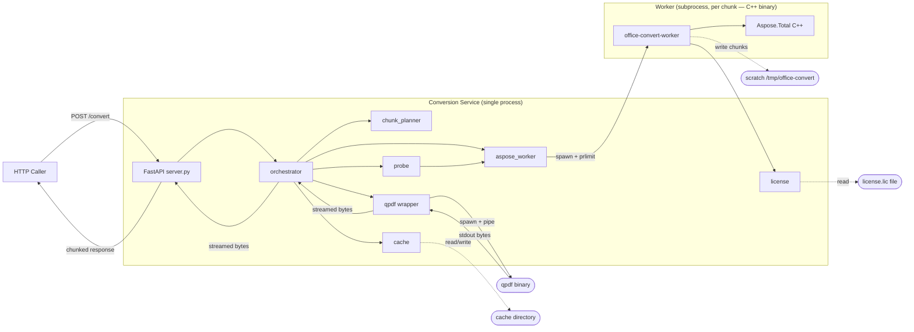

# Services — Office Converter (Local v1)

## Overview

This v1 has one logical service. AI-DLC's "service" concept maps to
"a coherent set of components coordinating to deliver a capability".
For a local single-binary HTTP server, this is the **Conversion
Service**.

A separate **Worker Process** is treated as a service collaborator —
it runs in a different process (subprocess of the main server
process) but is conceptually a stateless function rather than its own
service. Worker lifecycle is fully owned by the orchestrator inside
the Conversion Service.

## Service: Conversion Service

### Responsibilities

- Accept Office documents over HTTP and produce PDF outputs.
- Enforce the 2 GB RAM ceiling per chunk render via subprocess
  isolation and `prlimit`.
- Apply the chunk + subdivision + streaming-merge algorithm.
- Manage per-request lifecycle: scratch directory creation, request
  ID propagation, structured logging, cleanup on completion or
  failure.
- Validate Aspose license at server startup and surface expiry
  through `/health`.
- Enforce server-level and per-job concurrency budgets.

### Bounded Operations

The Conversion Service exposes exactly two operations on its HTTP
boundary (per FR-1 and FR-2):

1. `POST /convert` — convert one document.
2. `GET /health` — report readiness, license status, concurrency
   utilization.

### Internal Pipeline (single `POST /convert` call)

```
1. server.convert(file, options)
     ├── generate request_id (UUID)
     ├── acquire server-level semaphore (max_jobs)
     │     └── if exhausted → 503 + Retry-After
     ├── detect_format(file)
     │     └── on unsupported → 400 unsupported_format
     ├── license.is_expired()
     │     └── on expired → 503 license_expired
     ├── buffer file → scratch_dir/<request_id>/input.<ext>
     ├── compute source_sha256
     ├── cache.get_final(source_sha256)  [if options.cache]
     │     └── on hit → stream from cache → 200 OK
     └── delegate to orchestrator.convert_job(...)
            ├── probe(input_path, format)
            │     └── on probe failure → 422 input_unprocessable
            ├── chunk_planner.plan_chunks(probe_result)
            ├── for each chunk in plan (up to `parallel` concurrent):
            │     ├── cache.get_chunk(chunk_sha256)
            │     │     ├── hit → use cached PDF
            │     │     └── miss → aspose_worker.render_chunk(...)
            │     │            ├── on OOM → subdivide + recurse
            │     │            │     └── on subdivision floor → 500 subdivision_floor_exceeded
            │     │            └── on success → cache.put_chunk(...)
            ├── qpdf.concat_streaming(chunk_paths)
            │     ├── stream bytes → orchestrator yields → server StreamingResponse
            │     └── on merge failure → 500 merge_failed
            ├── cache.put_final(source_sha256, ...)  [if options.cache and not streamed]
            └── logging.emit_event("request_complete", ...)
2. server cleans up scratch_dir/<request_id>/ on completion or failure
3. server releases server-level semaphore
```

### Service-Level Concurrency Model

Two stacked budgets:

| Budget         | Owner            | Mechanism                              |
| -------------- | ---------------- | -------------------------------------- |
| `max_jobs`     | server           | `asyncio.Semaphore(max_jobs)` acquired before `convert_job` starts |
| `parallel`     | orchestrator     | `asyncio.Semaphore(parallel)` acquired before each chunk dispatch within one job |

Peak resident worker subprocesses = `max_jobs × parallel`. Peak Aspose
RAM = that × 2 GB.

### Service-Level State

The Conversion Service is **effectively stateless** between requests
modulo:

- The filesystem cache (read/written across requests, but each entry
  is content-addressable so no state coordination is needed).
- The `LicenseManager` instance (loaded once at startup, refreshed
  by `/health` calls on schedule).
- The server-level semaphore (in-memory, per-process).

No database. No shared state across requests beyond the cache and the
license. This is a deliberate v1 simplification — cloud scope re-
introduces DynamoDB for job state and S3 for cache.

### Service-Level Failure Modes

| Failure                            | Recovery                                                |
| ---------------------------------- | ------------------------------------------------------- |
| Single chunk OOM                   | Subdivide + retry (orchestrator)                        |
| Subdivision floor reached          | Fail request with 500 + diagnostic; no service-wide impact |
| License expired                    | Server returns 503 on every `/convert`; `/health` reports `ready: false` |
| qpdf binary missing                | Server returns 500 on every request (visible at startup via smoke test) |
| Scratch dir unwritable             | Server returns 500; `/health` could surface this in v2  |
| Aspose runtime fails to initialize | Worker subprocess exits 1; logged; request fails 500    |
| Cache directory unwritable         | Log a warning; treat cache as disabled for that request |
| Out of file descriptors / disk     | Server returns 500; operator-visible OS issue           |

### Worker Process (Service Collaborator)

The worker is a **native C++ binary** spawned as a separate OS
process per chunk render. It is NOT a long-lived service. Its
lifecycle:

- Binary location: `/usr/local/bin/office-convert-worker`, built
  in a Dockerfile builder stage from `worker_cpp/` sources linked
  against Aspose.Total C++ shared library.
- Spawned by `aspose_worker.render_chunk` via
  `asyncio.create_subprocess_exec` with `prlimit --as=2147483648`
  applied before exec.
- Lifetime: one render or one probe operation, ≤ chunk render time.
- Communication: command-line args in, stdout/stderr + exit code
  out. JSON on stdout in `--mode=probe`; binary PDF written to
  `--output` path in `--mode=render`.
- Resource limits: 2 GB virtual address space enforced via
  `prlimit`.
- Fresh state: no state survives the subprocess; the C++ binary
  re-applies the license via `Aspose::License::SetLicense()` at
  every invocation.
- Concurrent instances bounded by `max_jobs × parallel`.
- No Python loaded inside the worker process; only the Aspose C++
  shared library and libstdc++/glibc.

The "service" framing for the worker would be over-engineering — it
has no API, no contract beyond exit codes, and no shared state. It is
a function-as-a-process.

## Service Composition Diagram


