# Execution Plan — Office Converter (Local v1)

## Detailed Analysis Summary

### Change Impact Assessment

| Impact area          | Status | Notes                                                                  |
| -------------------- | ------ | ---------------------------------------------------------------------- |
| User-facing changes  | Yes    | New HTTP API (`POST /convert`, `GET /health`) on localhost             |
| Structural changes   | Yes    | New system end-to-end (greenfield)                                     |
| Data model changes   | Yes    | Internal: ChunkPlan, Chunk, ConversionResult, Diagnostic types         |
| API changes          | Yes    | New HTTP API surface (FR-1, FR-2)                                      |
| NFR impact           | Yes    | 2 GB RAM ceiling, structured logging, PBT, security baseline           |

### Risk Assessment

- **Risk Level**: Medium
  - Algorithm is non-trivial: chunk planning + RAM enforcement + subdivision-on-OOM + streaming merge inside a hard 2 GB ceiling.
  - Aspose.Total C++ has known operational quirks (license activation, format-specific memory amplification) that are discoverable only through real-document testing.
  - License expiry is a recurring operational risk (30-day temporary license).
  - Local-only scope keeps blast radius small — no external dependencies, no shared state, no production users.
- **Rollback Complexity**: Easy
  - It's a local service. Stopping the container is the rollback. No state to migrate, no other systems coupled to it.
- **Testing Complexity**: Moderate
  - PBT on chunk planner, subdivision logic, qpdf concat wrapper (NFR-6).
  - Integration tests via FastAPI `TestClient` on a small document corpus.
  - End-to-end smoke via `curl` against the running container.

## Workflow Visualization

```mermaid
flowchart TD
    Start(["User Request"])

    subgraph INCEPTION["🔵 INCEPTION PHASE"]
        WD["Workspace Detection<br/><b>COMPLETED</b>"]
        RA["Requirements Analysis<br/><b>COMPLETED</b>"]
        US["User Stories<br/><b>SKIP</b>"]
        WP["Workflow Planning<br/><b>IN PROGRESS</b>"]
        AD["Application Design<br/><b>EXECUTE</b>"]
        UG["Units Generation<br/><b>SKIP</b>"]
    end

    subgraph CONSTRUCTION["🟢 CONSTRUCTION PHASE"]
        FD["Functional Design<br/><b>EXECUTE</b>"]
        NFRA["NFR Requirements<br/><b>EXECUTE</b>"]
        NFRD["NFR Design<br/><b>EXECUTE</b>"]
        ID["Infrastructure Design<br/><b>SKIP</b>"]
        CG["Code Generation<br/><b>EXECUTE</b>"]
        BT["Build and Test<br/><b>EXECUTE</b>"]
    end

    subgraph OPERATIONS["🟡 OPERATIONS PHASE"]
        OPS["Operations<br/><b>PLACEHOLDER</b>"]
    end

    Start --> WD
    WD --> RA
    RA --> US
    US --> WP
    WP --> AD
    AD --> UG
    UG --> FD
    FD --> NFRA
    NFRA --> NFRD
    NFRD --> ID
    ID --> CG
    CG --> BT
    BT --> OPS
    OPS --> End(["Complete"])

    style WD fill:#4CAF50,stroke:#1B5E20,stroke-width:3px,color:#fff
    style RA fill:#4CAF50,stroke:#1B5E20,stroke-width:3px,color:#fff
    style US fill:#BDBDBD,stroke:#424242,stroke-width:2px,stroke-dasharray: 5 5,color:#000
    style WP fill:#4CAF50,stroke:#1B5E20,stroke-width:3px,color:#fff
    style AD fill:#FFA726,stroke:#E65100,stroke-width:3px,stroke-dasharray: 5 5,color:#000
    style UG fill:#BDBDBD,stroke:#424242,stroke-width:2px,stroke-dasharray: 5 5,color:#000
    style FD fill:#FFA726,stroke:#E65100,stroke-width:3px,stroke-dasharray: 5 5,color:#000
    style NFRA fill:#FFA726,stroke:#E65100,stroke-width:3px,stroke-dasharray: 5 5,color:#000
    style NFRD fill:#FFA726,stroke:#E65100,stroke-width:3px,stroke-dasharray: 5 5,color:#000
    style ID fill:#BDBDBD,stroke:#424242,stroke-width:2px,stroke-dasharray: 5 5,color:#000
    style CG fill:#4CAF50,stroke:#1B5E20,stroke-width:3px,color:#fff
    style BT fill:#4CAF50,stroke:#1B5E20,stroke-width:3px,color:#fff
    style OPS fill:#FFF59D,stroke:#F57F17,stroke-width:2px,color:#000
    style Start fill:#CE93D8,stroke:#6A1B9A,stroke-width:3px,color:#000
    style End fill:#CE93D8,stroke:#6A1B9A,stroke-width:3px,color:#000

    linkStyle default stroke:#333,stroke-width:2px
```

## Phases to Execute

### 🔵 INCEPTION PHASE

- [x] Workspace Detection (COMPLETED)
- [x] Reverse Engineering (SKIPPED — greenfield, no existing code)
- [x] Requirements Analysis (COMPLETED)
- [x] User Stories (SKIPPED — single endpoint, single-user local PoC, no distinct personas)
- [x] Workflow Planning (IN PROGRESS)
- [ ] Application Design — **EXECUTE**
  - **Rationale**: Multiple new components to define: HTTP server,
    orchestrator/job-runner, chunk planner, Aspose worker subprocess,
    qpdf merge wrapper, cache layer, license manager. Component
    boundaries and method signatures need explicit design before code
    generation.
- [ ] Units Generation — **SKIP**
  - **Rationale**: v1 is a single Python package shipped as one Docker
    image. There is no multi-package or multi-service decomposition
    to plan. Component boundaries are sufficient for direct code
    generation.

### 🟢 CONSTRUCTION PHASE

- [ ] Functional Design — **EXECUTE**
  - **Rationale**: Real business logic deserves explicit design before
    coding: chunk-planning algorithm, subdivision-on-OOM policy,
    cache key strategy, license-expiry state machine, failure
    classification. Skipping risks bugs in the algorithm-load-bearing
    surfaces that PBT is meant to verify.
- [ ] NFR Requirements — **EXECUTE**
  - **Rationale**: Hard NFRs are documented in `requirements.md` but
    need formal NFR-assessment treatment: performance budgets,
    security baseline checklist, observability event taxonomy,
    testability strategy. Required because security-baseline and
    property-based-testing extensions are Enabled (blocking).
- [ ] NFR Design — **EXECUTE**
  - **Rationale**: Implementation patterns for the NFRs: how exactly
    `prlimit` is invoked from Python, how the FastAPI streaming
    response is wired to qpdf stdout, how request-scoped logging
    propagates `request_id` across subprocesses.
- [ ] Infrastructure Design — **SKIP**
  - **Rationale**: "Infrastructure" for v1 collapses to a Dockerfile
    and a `docker run` invocation. There are no cloud resources, no
    Kubernetes manifests, no IaC. The Dockerfile is a Code Generation
    artifact; a separate Infrastructure Design stage would add
    ceremony without producing distinct content.
- [ ] Code Generation — **EXECUTE (ALWAYS)**
  - **Rationale**: Implementation planning and code generation needed.
    Output: Python package with orchestrator + chunk planner + qpdf
    wrapper, Aspose worker binary or wrapper (depending on integration
    decision), FastAPI server, Dockerfile, tests (unit + PBT +
    integration).
- [ ] Build and Test — **EXECUTE (ALWAYS)**
  - **Rationale**: Build instructions for the Docker image, unit test
    execution, PBT execution, integration test run via FastAPI
    `TestClient`, manual smoke test instructions via `curl`.

### 🟡 OPERATIONS PHASE

- [ ] Operations — **PLACEHOLDER**
  - **Rationale**: Future deployment and monitoring workflows. For v1
    local-only, operational concerns (license renewal, cache cleanup,
    log inspection) live in the README that Code Generation produces.

## Estimated Timeline

- **Total stages remaining to execute**: 6 (Application Design,
  Functional Design, NFR Requirements, NFR Design, Code Generation,
  Build and Test).
- **Estimated effort**: Moderate. Design stages are tightly bounded by
  the v1 scope already established. Code Generation has the broadest
  surface (multiple modules + Dockerfile + tests).

## Success Criteria

- **Primary Goal**: Working local HTTP service that converts DOCX,
  PPTX, XLSX, and PDF inputs to PDF outputs through the documented
  chunk-and-merge pipeline, inside the 2 GB per-subprocess RAM
  ceiling.
- **Key Deliverables**:
  - Python package implementing the orchestrator, chunk planner,
    Aspose worker subprocess, qpdf merge wrapper, cache, license
    manager.
  - FastAPI server exposing `POST /convert` and `GET /health`.
  - Dockerfile producing the v1 image.
  - Unit, property-based, and HTTP-integration test suites.
  - README covering Aspose license setup, container run, error
    diagnostics, and known v1 limitations.
- **Quality Gates**:
  - All unit tests pass.
  - PBT runs green on chunk planner, qpdf concat, subdivision logic.
  - Integration tests pass on the sample document corpus.
  - Manual smoke (`curl` against the container) returns a valid PDF.
  - Security baseline compliance: no secrets in source/image, input
    validation, no document content in logs.
  - Property-based testing extension compliance: PBT surfaces
    delivered with documented invariants.
