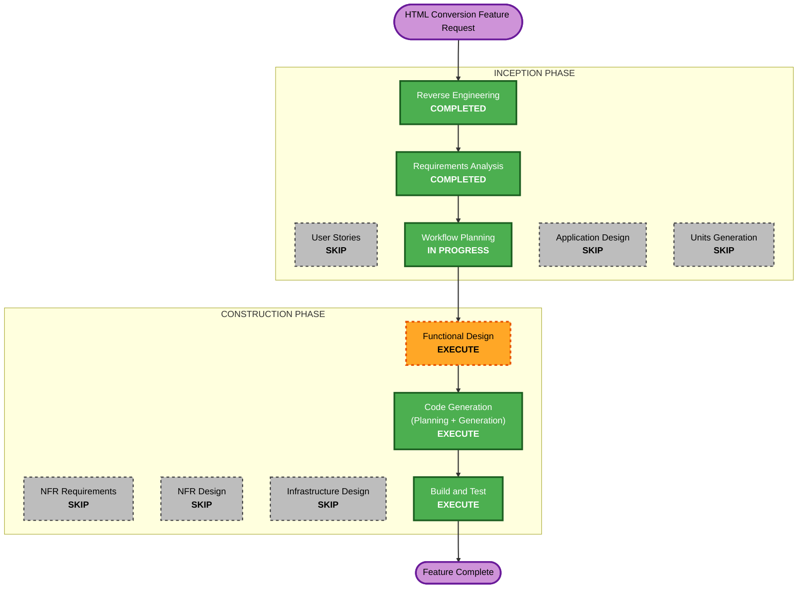

# Execution Plan — HTML → PDF Conversion (Dual-Engine, Go-Only)

**Date**: 2026-06-12 · **Requirements**: [`../requirements/html-conversion-requirements.md`](../requirements/html-conversion-requirements.md)

## Detailed Analysis Summary

### Transformation Scope (Brownfield)
- **Transformation Type**: Single-feature addition across multiple existing components; no
  architectural transformation. Adds one new external service (Gotenberg) to the local stack.
- **Primary Changes**: two new Go routes + `internal/gotenberg` client package; HTML format
  detection; `engine` telemetry field; C++ `worker-docx` accepts `"html"` + resource-loading
  deny policy; compose service; Streamlit comparison panel.
- **Related Components**: Go orchestrator (`cmd/`+`internal/`), C++ workers (`worker_cpp/`),
  compose stack, Streamlit UI. Python orchestrator and Helm chart explicitly untouched.

### Change Impact Assessment
- **User-facing changes**: Yes — two new API endpoints + new UI comparison panel.
- **Structural changes**: No — bypass pattern mirrors existing LibreOffice/EML paths.
- **Data model changes**: Yes (additive) — `DispatchFormat` gains `"html"`; `ConversionRecord`
  gains `engine`; new `engine_unavailable` failure class.
- **API changes**: Yes (additive only) — existing 14 endpoints unchanged; golden-parity gate
  unaffected (new routes excluded, documented divergence).
- **NFR impact**: Yes — SSRF deny policy on both engines (security), 10 MB HTML cap, Gotenberg
  client timeout, per-engine stats.

### Component Relationships
- **Primary Component**: Go orchestrator (`internal/server`, new `internal/gotenberg`,
  `internal/probe`, `internal/types`, `internal/oerrors`, `internal/config`, `internal/obs`).
- **Supporting Components**: `worker_cpp/formats/docx.cpp` (format guard + resource callback),
  `compose.yaml`/`compose.go.yaml` (gotenberg service), `office_convert_ui/app.py` (panel),
  `go.Dockerfile` (no change expected), Makefile targets (run/test convenience).
- **Dependent Components**: none externally — additive endpoints; classification-service
  consumer of `office-convert:go` unaffected (tag and existing contract unchanged).

### Risk Assessment
- **Risk Level**: Medium — multiple components + one new service + a C++ worker change that
  requires an image rebuild; mitigated by additive-only API surface and feature-branch PR flow.
- **Rollback Complexity**: Easy — revert the PR; no data migrations; Gotenberg service is
  compose-gated.
- **Testing Complexity**: Moderate — fake-Gotenberg integration tests + PBT for sniffer/deny
  policy + license-gated E2E for real fidelity comparison.

## Workflow Visualization



### Text Alternative

```
INCEPTION:    Reverse Engineering (COMPLETED) -> Requirements Analysis (COMPLETED)
              -> User Stories (SKIP) -> Workflow Planning (this doc)
              -> Application Design (SKIP) -> Units Generation (SKIP)
CONSTRUCTION: Functional Design (EXECUTE) -> NFR Requirements (SKIP) -> NFR Design (SKIP)
              -> Infrastructure Design (SKIP) -> Code Generation (EXECUTE)
              -> Build and Test (EXECUTE)
```

## Phases to Execute

### 🔵 INCEPTION PHASE
- [x] Workspace Detection (COMPLETED — resume, brownfield)
- [x] Reverse Engineering (COMPLETED 2026-06-12, approved)
- [x] Requirements Analysis (COMPLETED — html-conversion-requirements.md approved)
- [x] User Stories — SKIP
  - **Rationale**: single operator/developer persona; internal benchmarking feature; acceptance
    criteria already concrete in the requirements doc.
- [x] Workflow Planning (THIS DOCUMENT)
- [ ] Application Design — SKIP
  - **Rationale**: no new component *types* — `internal/gotenberg` mirrors the existing
    `internal/libreoffice`/`internal/email` engine-client pattern; dependencies and method
    surfaces are already mapped by the integration-point trace. Component-level method/business-
    rule detail lands in Functional Design.
- [ ] Units Generation — SKIP
  - **Rationale**: single unit of work (`html-conversion`) in a single repo/deliverable.

### 🟢 CONSTRUCTION PHASE (unit: `html-conversion`)
- [ ] Functional Design — EXECUTE
  - **Rationale**: new business logic needing precise definition: HTML sniffing rules, the
    shared deny-list policy (single source, two enforcement points), engine routing, wait-option
    validation, failure mapping, engine-tagged stats. **PBT-01 requires the Testable Properties
    analysis here** (sniffer + deny-matcher properties).
- [ ] NFR Requirements — SKIP
  - **Rationale**: NFRs already enumerated and approved in the requirements doc (NFR-1…NFR-6);
    tech stack fully determined (Go + existing worker + gotenberg:8). A separate NFR pass would
    duplicate it.
- [ ] NFR Design — SKIP
  - **Rationale**: NFR Requirements skipped; the one NFR-heavy design item (deny-list policy
    shape) is in Functional Design scope.
- [ ] Infrastructure Design — SKIP
  - **Rationale**: infra delta is one compose service block + env vars (Q6:A — Helm deferred);
    folded into Code Generation, consistent with the original project's approach.
- [ ] Code Generation — EXECUTE (Part 1 plan w/ checkboxes → approval → Part 2 generation)
- [ ] Build and Test — EXECUTE

### 🟡 OPERATIONS PHASE
- [ ] Operations — PLACEHOLDER (Helm/EKS rollout of Gotenberg is the named follow-up)

## Module Update Strategy (Brownfield)

- **Update Approach**: Sequential with one parallel track.
- **Critical Path**: C++ worker change → Go orchestrator → compose wiring → UI.
- **Coordination Points**: worker argv contract (`--format html` accepted by `worker-docx`);
  `OFFICE_CONVERT_GOTENBERG_URL`; the two endpoint paths consumed by the UI.

| Order | Module | Change | Scope |
|---|---|---|---|
| 1 | `worker_cpp/` | `docx.cpp` accepts `"html"`; `IResourceLoadingCallback` deny policy | Minor (image rebuild) |
| 2 | Go orchestrator | types/probe/oerrors/config/obs + `internal/gotenberg` + 2 routes | Minor (additive) |
| 3 | compose | `gotenberg` service + deny-list flags + env | Config-only |
| 4 | `office_convert_ui/` | comparison panel + engine column (parallel-safe with 3) | Minor |
| 5 | tests/golden docs | Go tests + PBT + parity-gate divergence note | Test-only |

- **Testing Checkpoints**: after 2 (unit+integration w/ fake Gotenberg), after 3 (live local
  stack, acceptance criteria 1–4), after 4 (UI panel, criterion 5).
- **Rollback Strategy**: single feature branch + PR (main is branch-protected); revert PR
  restores everything; no persistent state involved.

## Estimated Timeline
- **Total stages remaining**: 3 (Functional Design → Code Generation → Build and Test)
- **Estimated Duration**: 1–2 working sessions (Functional Design ~30 min; Code Generation the
  bulk; Build and Test verification on the local Go stack).

## Success Criteria
- **Primary Goal**: benchmark Gotenberg vs Aspose HTML→PDF on latency AND fidelity (JS being
  the differentiator), from the existing UI.
- **Key Deliverables**: 2 endpoints, `internal/gotenberg` package, worker HTML guard + deny
  callback, compose service, UI comparison panel, per-engine stats, tests (unit/PBT/integration)
  + corpus samples, parity-divergence note.
- **Quality Gates**: `go vet` + `go test ./...` green incl. new PBT; golden gate still 14/14;
  acceptance criteria 1–6 from the requirements doc verified on the local stack; security
  acceptance (criterion 3, SSRF deny on both engines) demonstrated.
