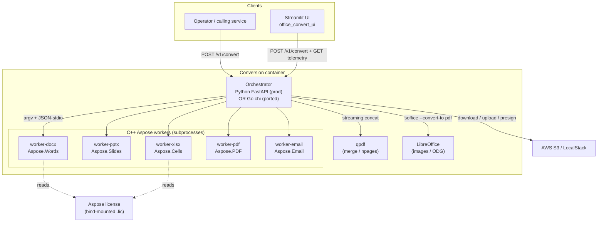
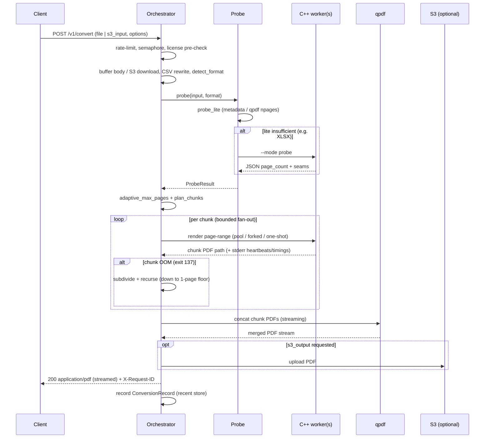

# System Architecture

> Reverse-engineered 2026-06-12. Reflects the code as it stands on `main`.

## System Overview

The Office Conversion Service is a **single-container, subprocess-fan-out** document-to-PDF
converter. One orchestrator process owns the HTTP API and the conversion pipeline; it shells out
to **five per-product C++ Aspose worker binaries** (and to LibreOffice for image/ODG fallback,
and to `qpdf` for merging). The design is shaped by one hard constraint: **bounded per-container
RAM** (compose: `mem_limit 4g` + `memswap_limit 6g`; EKS: 4Gi limit, no swap). Large documents
are split into page-range chunks rendered in RAM-capped subprocesses and stream-merged back into
one PDF, so peak memory tracks the chunk size, not the whole document.

The repository currently holds **two interchangeable orchestrator implementations** behind the
same 14-endpoint HTTP contract:
- **Python / FastAPI** (`office_convert/`) — the deployed production backend.
- **Go / chi** (`cmd/orchestrator` + `internal/*`) — a behavior-parity port, merged to `main`,
  **not yet cut over** (Phase 8 pending). A golden-fixture parity gate (14/14) proves wire
  equivalence.

The C++ workers, the JSON-stdio worker protocol, the Streamlit UI, and the Helm chart are
**shared and unchanged** across the two orchestrators.

## Architecture Diagram

## Component Descriptions

### Orchestrator (Python `office_convert/`)
- **Purpose**: HTTP service + conversion pipeline (current prod backend).
- **Responsibilities**: routing, validation, rate limiting, probe, chunk planning, worker
  dispatch (one-shot / pool / forked-pool), OOM subdivision, qpdf merge, streaming + S3 tee,
  cache, in-memory observability stores, structured logging.
- **Dependencies**: FastAPI/Starlette/uvicorn, pydantic-settings, boto3, the C++ workers, `qpdf`,
  `soffice`, `prlimit`.
- **Type**: Application.

### Orchestrator (Go `cmd/orchestrator` + `internal/*`)
- **Purpose**: Behavior-parity reimplementation of the Python orchestrator (pre-cutover).
- **Responsibilities**: same as above; GIL-implicit safety re-expressed as explicit `sync.Mutex`
  in the obs stores and counters; chi routing; aws-sdk-go-v2 for S3; `go:embed` for the
  dashboard/landing HTML.
- **Dependencies**: chi/v5, aws-sdk-go-v2 (+smithy), testify, go-cmp, rapid (tests); same C++
  workers + system binaries.
- **Type**: Application.

### C++ Aspose workers (`worker_cpp/`)
- **Purpose**: The render engine — five binaries, one Aspose product each.
- **Responsibilities**: per-product license activation, probe (page count), page-range render,
  JSON-stdio pool protocol (load-once-render-many; fork-after-load), stderr heartbeats/timings,
  exit-code failure signaling.
- **Dependencies**: Aspose.Words 26.3, Aspose.Slides 26.4, Aspose.Cells 26.4, Aspose.PDF 26.4,
  Aspose.Email 25.12, each with its own CodePorting framework (except Cells).
- **Type**: Application (native).

### Streamlit UI (`office_convert_ui/`)
- **Purpose**: Operator/demo front-end (backend-agnostic).
- **Responsibilities**: submit conversions, live stats/charts, history, presigned download,
  embedded dashboard iframe.
- **Dependencies**: streamlit, requests, plotly, pandas; the HTTP contract; docker socket
  (events feed, optional).
- **Type**: Application (front-end).

### Packaging / deploy (`Dockerfile`, `go.Dockerfile`, `Dockerfile.ui`, `compose*.yaml`, `Makefile`, `deploy/helm/`)
- **Purpose**: build, run locally, and deploy to EKS.
- **Responsibilities**: multi-stage images, mem/swap limits, S3 wiring, ALB ingress, IRSA, CI.
- **Type**: Infrastructure.

## Data Flow

Core `POST /v1/convert` happy path (Aspose-routed format):

## Integration Points

- **External APIs**: AWS S3 (source download, output upload, presigned GET). Locally emulated by
  LocalStack (`localstack/localstack:3.8`, host port 4567 → container 4566).
- **Databases**: None. All cross-request state (recent conversions, progress, heartbeats,
  timings) is **in-memory, per-process, lost on restart** — an explicit single-replica /
  single-worker design assumption (tripwire for multi-replica).
- **Third-party services / binaries**: Aspose.Total for C++ (licensed render engine, invoked as
  subprocess), LibreOffice headless (`soffice`), `qpdf`, `prlimit`.
- **Filesystem**: scratch dir (`/tmp/office-convert`, per-request working files) and optional
  content-addressable cache (`/cache`).

## Infrastructure Components

- **CDK Stacks**: None. Deployment is **Helm** (`deploy/helm/office-convert`) onto EKS.
- **Deployment Model**: Single Deployment for the API (default 1 replica), single Deployment for
  the UI, both fronted by a shared ALB (`group.name: office-convert`) via two Ingress resources
  (internet-facing, ACM HTTPS, corp-CIDR-restricted). License supplied via a pre-existing
  `aspose-license` Secret; config via a ConfigMap of `OFFICE_CONVERT_*` env vars; S3 access via
  IRSA (ServiceAccount role-arn annotation).
- **Networking**: API Service `ClusterIP:80 → 8080`; UI Service `ClusterIP:8501`. Local stack
  binds API to `127.0.0.1:8080`, UI to `127.0.0.1:8501`, LocalStack to `127.0.0.1:4567`.
- **Resource posture**: API requests `cpu 1 / mem 2Gi`, limits `cpu 4 / mem 4Gi`. No swap on EKS
  nodes (accepted OOM risk for inputs > ~250 MB); local compose adds a 2 GiB swap cushion.
- **Security posture**: non-root (uid 1000), `cap_drop: ALL`, `allowPrivilegeEscalation: false`;
  read-only rootfs locally (Helm sets it false), tmpfs scratch. UI currently runs as root (known
  TODO).
