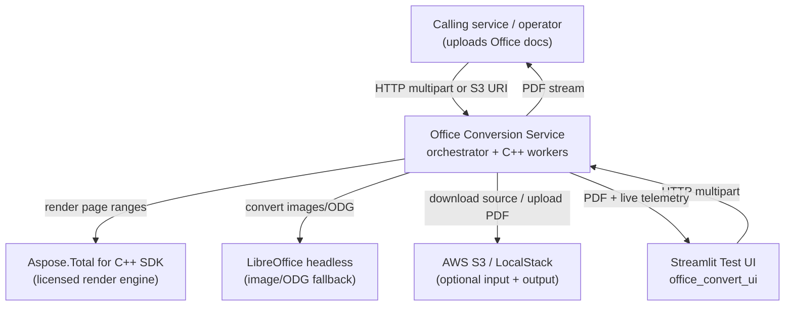

# Business Overview

> Reverse-engineered from the codebase on 2026-06-12. Source of truth is the code under
> the workspace root; this document summarizes the *business* meaning of that code.

## Business Context Diagram

## Business Description

- **Business Description**: The system is a **document conversion service** that turns Office,
  email, image, and PDF inputs into a single normalized **PDF** output. Its differentiating
  capability is **bounded-memory conversion of very large documents**: rather than loading a
  whole document into one renderer (which would exceed the per-container RAM ceiling on large
  inputs), it **probes** the document for its page count, **plans non-overlapping page-range
  chunks**, renders each chunk in an isolated, RAM-capped subprocess, and **streams-merges** the
  chunk PDFs back into one output. It degrades gracefully under memory pressure (chunk
  subdivision, swap cushion) instead of failing outright.

- **Business Transactions**:
  1. **Convert a document to PDF** (`POST /v1/convert`) — the core transaction. Accepts an
     uploaded file or an S3 source URI plus per-request options; returns a streamed PDF and
     optionally writes the PDF to S3. Covers Word, PowerPoint, Excel, PDF, legacy binary Office,
     CSV, ODG, raster/vector images, and email (EML).
  2. **Report service health & license posture** (`GET /health`) — readiness for load balancers
     and operators, including Aspose license days-remaining and active-job count.
  3. **Observe an in-flight conversion** (`GET /v1/jobs/{id}/{progress,heartbeats,timings}`,
     `GET /v1/jobs/active`) — weighted progress %, per-worker RAM/swap/CPU heartbeats, and
     per-stage timings, surfaced live to the dashboard.
  4. **Report recent conversions & throughput stats** (`GET /v1/conversions`,
     `GET /v1/conversions/stats`) — a paginated feed of completed conversions and per-format
     count/avg/p95 latency.
  5. **Report container resource usage** (`GET /v1/stats`, `GET /v1/workers`) — cgroup CPU/memory
     and the live worker-process inventory.
  6. **Manage the conversion cache** (`DELETE /v1/cache`) — wipe the content-addressable PDF
     cache.
  7. **Mint a download link** (`GET /v1/downloads/presign`) — presigned S3 GET URL for an output
     object.
  8. **Render the operator dashboard / landing page** (`GET /v1/dashboard`, `GET /`).

- **Business Dictionary**:
  | Term | Meaning |
  | --- | --- |
  | **Probe** | A cheap inspection of the input to determine format and page/slide/sheet count, used to plan chunks. Two-tier: metadata-only "lite" probe first, Aspose worker probe as fallback. |
  | **Chunk** | A contiguous, 1-based, inclusive page range `[start, end]` rendered by one worker invocation. Chunks form a non-overlapping cover of the whole document. |
  | **Chunk plan** | The ordered set of chunks for a document, sized to fit the RAM budget given the format's memory-amplification factor. |
  | **Subdivision** | The recovery action when a chunk OOMs: the page range is halved and re-rendered, recursively, down to a single-page floor. |
  | **Worker** | A compiled C++ binary (one per Aspose product) that links a single Aspose SDK and renders a page range to PDF. Invoked as a subprocess. |
  | **Pool / forked pool** | Performance mode where a worker loads the document once and renders many chunks (load-once-render-many). The forked pool forks N children after load (copy-on-write) to render concurrently from one in-memory document. |
  | **Natural seam** | A document-intrinsic page boundary (e.g. section break) the planner may prefer as a chunk edge. |
  | **Amplification factor** | The empirical ratio of peak render RAM to input bytes for a format; drives chunk sizing. |
  | **Heartbeat** | A periodic JSON pulse a worker emits (phase, elapsed, RSS, swap, CPU) so a long load/render is observable rather than opaque. |
  | **Failure class** | A canonical, wire-stable error code (e.g. `render_failed`, `input_too_large`, `license_expired`) mapped to an HTTP status. |
  | **License state** | Classification of the Aspose license validity window: permanent / healthy / warn / critical / expiring_today / expired. |

## Component Level Business Descriptions

### Orchestrator (Python `office_convert/` — current prod; Go `cmd/`+`internal/` — ported, pre-cutover)
- **Purpose**: Owns the conversion business transaction end-to-end: validate input, probe, plan
  chunks, dispatch to workers, recover from OOM, merge, stream/persist, and record telemetry.
- **Responsibilities**: HTTP contract, input validation & size ceilings, rate limiting, license
  pre-checks, format detection & routing (Aspose vs LibreOffice vs email pipeline), cache
  lookup/store, S3 source/sink, observability stores, and the failure taxonomy.

### C++ Aspose workers (`worker_cpp/`)
- **Purpose**: The render engine. Each binary converts a page range of one format to PDF using a
  single Aspose product, isolated from the others.
- **Responsibilities**: License activation per product, probing (page count), page-range
  rendering, the JSON-stdio pool protocol, heartbeats/timings, and exit-code-based failure
  signaling (including OOM at 137).

### Streamlit Test UI (`office_convert_ui/`)
- **Purpose**: An operator/demo front-end for submitting conversions and watching the service
  live. Backend-agnostic — talks only to the HTTP contract.
- **Responsibilities**: Upload + convert, conversion history with re-run and presigned download,
  live KPI tiles, CPU/RAM sparklines, worker table, per-format perf, live RAM/timing/Gantt
  charts, and an embedded `/v1/dashboard` iframe.

### Packaging, deploy & ops (`Dockerfile*`, `compose*.yaml`, `Makefile`, `deploy/helm/`, `.github/`)
- **Purpose**: Build the multi-stage images (C++ builder + Python or Go runtime), run the local
  stack, and deploy to EKS.
- **Responsibilities**: Reproducible builds, memory/swap limits, S3 (LocalStack locally, IRSA on
  EKS), ALB ingress, CI (lint/type/test + go-test + helm-lint + Trivy), and the Python→Go
  golden-parity gate.
