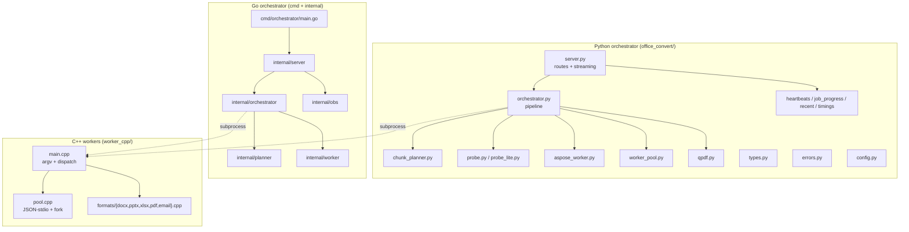

# Code Structure

> Reverse-engineered 2026-06-12.

## Build System

- **Python orchestrator**: `hatchling` (PEP 517) via `pyproject.toml`; package `office_convert`.
  `requires-python = ">=3.12,<3.13"`. Lint/format `ruff`, types `mypy --strict`. Test `pytest`
  (+ `pytest-xdist`, `pytest-asyncio`, `hypothesis`, `pytest-cov` with an 80% gate).
- **Go orchestrator**: Go modules, module `github.com/opus2/office-convert-orchestrator`
  (`go.mod`, Go 1.26). **Builds require `GOFLAGS=-mod=mod`** because the repo's `vendor/`
  (Aspose C++ libs) collides with Go's vendor-mode auto-detect.
- **C++ workers**: CMake (≥3.25), gcc-12/g++-12, C++17. `worker_cpp/CMakeLists.txt` defines an
  `add_aspose_worker()` macro that emits five binaries with **per-binary isolated link lines**
  and `$ORIGIN`-relative RPATHs. Release flags: `-O2 -flto -fvisibility=hidden -fdata-sections
  -ffunction-sections`, link `--gc-sections -s`.
- **Images**: `Dockerfile` (Python, 2-stage: C++ builder + python:3.12-slim runtime),
  `go.Dockerfile` (3-stage: C++ builder + golang:1.26 builder + debian-slim runtime),
  `Dockerfile.test` (test runner), `Dockerfile.ui` (Streamlit).
- **Orchestration**: `Makefile` (build / test / qa / up-down / convert / verify-vendor /
  golden-capture-verify / build-go-test-go-run-go / EKS deploy). `compose.yaml` +
  `compose.go.yaml` overlay.

## Key Modules

### Existing Files Inventory

**Python orchestrator — `office_convert/`** (current prod backend)
- `server.py` — FastAPI app factory; all 14 routes; streaming response assembly; S3 tee; `HealthChecker`; `ConversionRecord` building.
- `orchestrator.py` — async pipeline `convert_job()`: cache → probe → plan → dispatch → merge → stream.
- `chunk_planner.py` — pure plan algorithm: `adaptive_max_pages`, `plan_chunks`, `subdivide`, `chunk_sha256`.
- `probe.py` — `detect_format` (magic bytes + OOXML/OLE2), `probe`, `parse_probe_json`, accepted-format sets.
- `probe_lite.py` — metadata-only probe (OOXML app.xml, PPTX zip slide count, `qpdf --show-npages`, size fallback).
- `aspose_worker.py` — one-shot subprocess `render_chunk` / `_run_worker` + exit-code mapping.
- `worker_pool.py` — `WorkerPool`, `ForkedWorkerPool`, `PooledWorker`, `ForkedPoolLeader`; JSON-stdio protocol; stderr tailing.
- `qpdf.py` — `concat_streaming` (streaming merge with cache tee).
- `types.py` — frozen dataclasses/enums: `Chunk`, `ChunkPlan`, `ProbeResult`, `ConversionOptions/Result`, `Diagnostic`, `FormatName`, `FailureClass`, `LicenseState`.
- `errors.py` — `ConversionError` hierarchy (18 classes) + HTTP-status mapping.
- `config.py` — `Settings` (pydantic-settings, `OFFICE_CONVERT_*` env, ~30 fields).
- `cache.py` — content-addressable filesystem cache; atomic temp+rename.
- `rate_limit.py` — per-IP token bucket + LRU eviction.
- `license.py` — Aspose `.lic` XML expiry parse + `classify`.
- `heartbeats.py` / `timings.py` — per-request bounded deques (5000 / 1000), 30-min TTL.
- `job_progress.py` — per-request weighted progress (load 30% / render 65% / merge 5%).
- `recent.py` — ring buffer (200) of completed conversions + cursor pagination.
- `container_stats.py` — cgroup v1/v2 stats + `/proc` worker enumeration.
- `s3_client.py` — boto3 download/upload/presign + allowlist + URL parsing (in `asyncio.to_thread`).
- `csv_input.py` — pure-stdlib CSV → minimal XLSX.
- `libreoffice_convert.py` — `soffice` fallback for ODG + images.
- `aspose_email_convert.py` — EML → MHT (worker-email) → PDF (worker-docx) pipeline.
- `logging.py` — structured JSON/human logging; `emit_event`; request-id ContextVar.

**Go orchestrator — `cmd/` + `internal/`** (ported, pre-cutover)
- `cmd/orchestrator/main.go` — wiring/startup; `healthcheck` sub-command (used by Docker HEALTHCHECK); graceful shutdown.
- `internal/server/` — `server.go` (chi router, 14 routes, GET handlers), `convert.go` (POST handler + deferred-status streamWriter + finishStream/S3), `health.go`, `embed.go` (`go:embed` dashboard/landing).
- `internal/orchestrator/orchestrator.go` — `ConvertJob` pipeline; `renderAll` bounded fan-out; `renderWithRetry` OOM recursion; mutex `counters`.
- `internal/planner/` — `PlanChunks`, `AdaptiveMaxPages`, `Subdivide`, `ChunkSHA256` (+ `pbt_test.go` rapid PBT).
- `internal/worker/` — `RunWorker`, `WorkerPool`, `ForkedPoolLeader`/`ForkedWorkerPool`, exit-code map, stderr tailer; `testdata/fakeworker/main.go`.
- `internal/obs/` — `RingStore`, `JobProgressStore`, `RecentStore` (+ cursor) — **all explicit `sync.Mutex`**.
- `internal/{config,types,oerrors,license,cache,probe,csvinput,qpdf,ratelimit,containerstats,libreoffice,email,s3,oclog}` — ports of the like-named Python modules. `s3` is split into pure helpers (`s3.go`) + aws-sdk-go-v2 impl (`aws.go`).

**C++ workers — `worker_cpp/`**
- `main.cpp` — argv parse, mode dispatch (render/probe/pool/forked-pool), exit codes.
- `pool.cpp` / `pool.h` — JSON-stdio protocol, `Heartbeat` thread, `pool_loop` + `pool_loop_forked`.
- `error.cpp` / `error.h` — exit-code constants + `WorkerError` subclasses + diagnostic JSON.
- `render.h` / `probe.h` / `probe_util.h` / `timing_util.h` / `license.h` — slim shared declarations + header-only helpers.
- `formats/{docx,pptx,xlsx,pdf,email}.cpp` — per-product TUs (each defines `apply_license`/`dispatch_render`/`dispatch_probe`/`pool_load`/`pool_render`).
- `CMakeLists.txt` — `add_aspose_worker()` macro, `_find_one_so()`, per-binary RPATH/link isolation.

**UI / tests / tooling**
- `office_convert_ui/app.py` — Streamlit dashboard (~2.8k lines).
- `tests/` — `unit/`, `integration/`, `property/` (hypothesis), `e2e/` (testcontainers), `corpus/`, `conftest.py` (fake worker shim via reportlab).
- `scripts/capture_golden.py` — freezes Python HTTP responses → Go golden fixtures.
- `smoke_test/` — Words-only Aspose license/SDK smoke (`Dockerfile.smoke`, `words_smoke.cpp`).
- `deploy/` — `helm/office-convert/` (8 templates + values), `localstack/init-buckets.sh`, `iam/`, `scripts/` (route53, portforward).

## Design Patterns

### Probe → Plan → Render → Merge (pipeline)
- **Location**: `orchestrator.py::convert_job` / `internal/orchestrator/orchestrator.go::ConvertJob`.
- **Purpose**: bounded-memory conversion of arbitrarily large documents.
- **Implementation**: probe page count → adaptive chunk plan → fan-out render with bounded
  concurrency → stream-merge via qpdf, with OOM subdivision as the recovery path.

### Subprocess isolation per Aspose product (one binary per product)
- **Location**: `worker_cpp/CMakeLists.txt` + `formats/*.cpp`.
- **Purpose**: avoid the CodePorting framework SONAME ABI collision that crashed XLSX when all
  products were linked into one binary.
- **Implementation**: five binaries, each linking exactly one product's `.so` set; orchestrator
  resolves `{worker_binary_prefix}-{format}`.

### Load-once-render-many (worker pool) + fork-after-load
- **Location**: `worker_pool.py` / `internal/worker/pool.go` + `worker_cpp/pool.cpp`.
- **Purpose**: amortize document-load cost across chunks; fork-after-load shares the loaded doc
  copy-on-write across N renderers, keeping peak RAM ≈ 1× instead of N×.
- **Implementation**: JSON-stdio protocol; seq-tagged responses demuxed by the leader; XLSX is
  fork-unsafe (Cells `Startup()` + OpenSSL) so it uses the legacy independent pool / reload-per-render.

### Frozen value types + canonical failure taxonomy
- **Location**: `types.py` / `internal/types` + `errors.py` / `internal/oerrors`.
- **Purpose**: immutable domain data + a wire-stable error → HTTP-status mapping.

### In-memory observability stores (singleton, bounded, TTL)
- **Location**: `heartbeats.py`, `timings.py`, `job_progress.py`, `recent.py` / `internal/obs`.
- **Purpose**: live progress/telemetry without a datastore. **Per-process** — a deliberate
  single-replica assumption (Go re-expresses GIL safety as explicit mutexes).

### Streaming with deferred status (Go) / first-chunk materialization (Python)
- **Location**: `convert.go::streamWriter` / `server.py::_tee_to_s3`.
- **Purpose**: hold the HTTP status line until the first body byte so a pre-stream error still
  returns a JSON `Diagnostic` rather than a half-written 200.

## Critical Dependencies

### Aspose.Total for C++
- **Version**: Words 26.3, Cells 26.4, Slides 26.4, PDF 26.4, Email 25.12 (each + its CodePorting framework, except Cells which is plain C++).
- **Usage**: the render engine, linked into the five worker binaries; license bind-mounted.
- **Purpose**: the only component that actually rasterizes/renders Office/PDF/email to PDF.

### qpdf (system binary)
- **Usage**: streaming PDF concat (`--empty --pages ... -- -`) and `--show-npages` in the lite probe.
- **Purpose**: chunk merge + cheap PDF page count.

### LibreOffice headless (`soffice`)
- **Usage**: fallback conversion for ODG and raster/vector images.
- **Purpose**: formats Aspose.Total C++ does not cover.

### FastAPI / uvicorn (Python) · chi/v5 + aws-sdk-go-v2 (Go)
- **Usage**: HTTP layer of each orchestrator.
- **Purpose**: serve the 14-endpoint contract.
