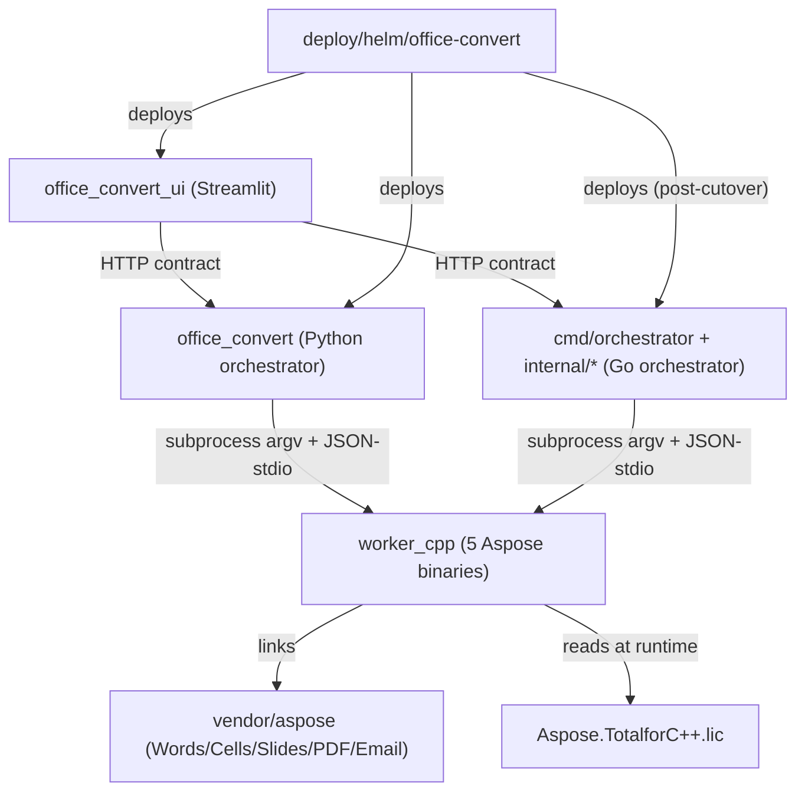

# Dependencies

> Reverse-engineered 2026-06-12.

## Internal Dependencies

### Streamlit UI depends on Orchestrator
- **Type**: Runtime (HTTP).
- **Reason**: UI is backend-agnostic; it only consumes the 14-endpoint contract (convert,
  health, jobs telemetry, conversions, stats, presign, dashboard iframe). Works against either
  Python or Go orchestrator unchanged.

### Orchestrator (Python or Go) depends on C++ workers
- **Type**: Runtime (subprocess).
- **Reason**: Neither language can render Aspose natively; both shell out to
  `office-convert-worker-{format}` via argv + the JSON-stdio pool protocol. Exit codes are the
  cross-boundary failure signal.

### C++ workers depend on vendored Aspose + license
- **Type**: Compile + runtime.
- **Reason**: each binary links exactly one product's `.so` set (per-binary RPATH isolation to
  avoid the CodePorting SONAME collision) and reads the umbrella `.lic` at startup.

### Helm chart depends on the images
- **Type**: Deploy.
- **Reason**: deploys API + UI; cutover from Python→Go is an **image-only roll** (ConfigMap and
  contract unchanged).

### Go orchestrator parity-depends on Python orchestrator (tests only)
- **Type**: Test.
- **Reason**: `scripts/capture_golden.py` freezes Python HTTP responses; Go's `golden_test.go`
  diffs against them (`go-cmp` semantic compare). Removed when Python is retired (Phase 9).

## External Dependencies

### Aspose.Total for C++
- **Version**: Words 26.3, Cells 26.4, Slides 26.4, PDF 26.4, Email 25.12 (+ CodePorting Cs2Cpp
  framework per product, except Cells).
- **Purpose**: the render engine (Office/PDF/email → PDF, page-range subsetting).
- **License**: commercial (Aspose); umbrella `Aspose.TotalforC++.lic`, temporary/subscription
  with an expiry date the orchestrator parses and classifies.

### qpdf
- **Purpose**: streaming PDF concat + `--show-npages` lite probe. **License**: Apache-2.0.

### LibreOffice (`libreoffice-core-nogui`, `libreoffice-draw-nogui`)
- **Purpose**: ODG + raster/vector image fallback conversion. **License**: MPL-2.0.

### FastAPI / Starlette / uvicorn (Python)
- **Version**: fastapi `>=0.115,<0.116`, uvicorn[standard] `>=0.32,<0.49`. **Purpose**: HTTP.
  **License**: MIT / BSD.

### pydantic / pydantic-settings
- **Version**: `>=2.9,<2.14` / `>=2.6,<2.15`. **Purpose**: models + env config. **License**: MIT.

### boto3 / botocore (Python)
- **Version**: `>=1.35,<2`. **Purpose**: S3 download/upload/presign. **License**: Apache-2.0.

### aiofiles, python-multipart (Python)
- **Version**: `24.1.*` / `0.0.29`. **Purpose**: async file I/O + multipart parsing. **License**: Apache-2.0 / Apache-2.0.

### go-chi/chi/v5 (Go)
- **Version**: v5.3.0. **Purpose**: HTTP routing (method + wildcard). **License**: MIT.

### aws-sdk-go-v2 (+ config, feature/s3/manager, service/s3) + smithy-go (Go)
- **Version**: core v1.41.9 / s3 v1.102.2 / manager v1.22.22 / smithy v1.26.0. **Purpose**: S3.
  **License**: Apache-2.0.

### testify / go-cmp / rapid (Go, test-only)
- **Version**: v1.11.1 / v0.7.0 / v1.3.0. **Purpose**: assertions / semantic diff / PBT.
  **License**: MIT / BSD-3 / MPL-2.0.

### Python test/dev deps
- **pytest** 8.3.*, **pytest-asyncio** `>=0.24,<1.4`, **pytest-xdist** 3.6.*, **pytest-cov**
  `>=5,<8`, **Hypothesis** 6.*, **httpx** `>=0.27,<0.29`, **moto[s3]** `>=5.0,<6`,
  **testcontainers** 4.8.*, **reportlab** `>=4.4,<4.6`, **mypy** 1.13.*, **ruff** 0.7.*,
  **python-docx/pptx/openpyxl** (corpus generation). **License**: MIT/BSD/Apache mix.

### Streamlit stack
- **streamlit** 1.57.*, **plotly** 6.7.*, **pandas** 3.0.*, **requests** 2.34.*. **License**:
  Apache-2.0 / MIT / BSD / Apache-2.0.

### System binaries (runtime image)
- **prlimit** (`util-linux`, RLIMIT_AS), **fontconfig** + **fonts-dejavu-core** (Aspose text
  rendering), **ca-certificates**, libstdc++6/libgcc-s1/libfontconfig1/libfreetype6/libpng16/
  libxml2/libexpat1/libuuid1 (Aspose `.so` runtime deps).
